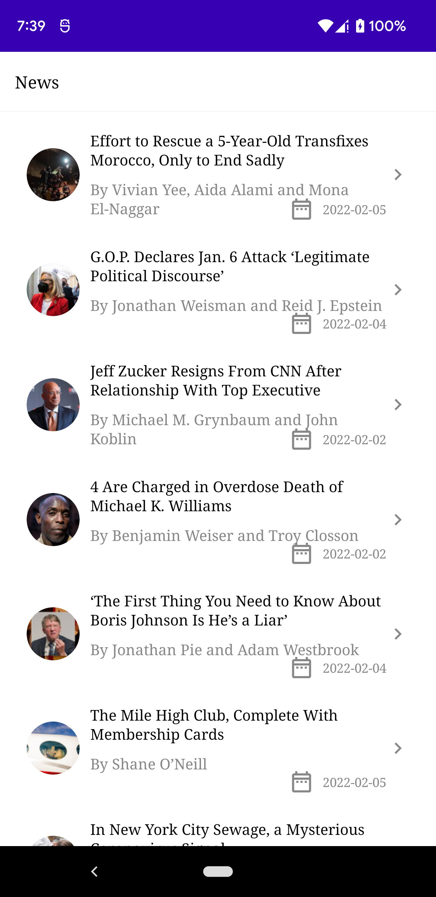
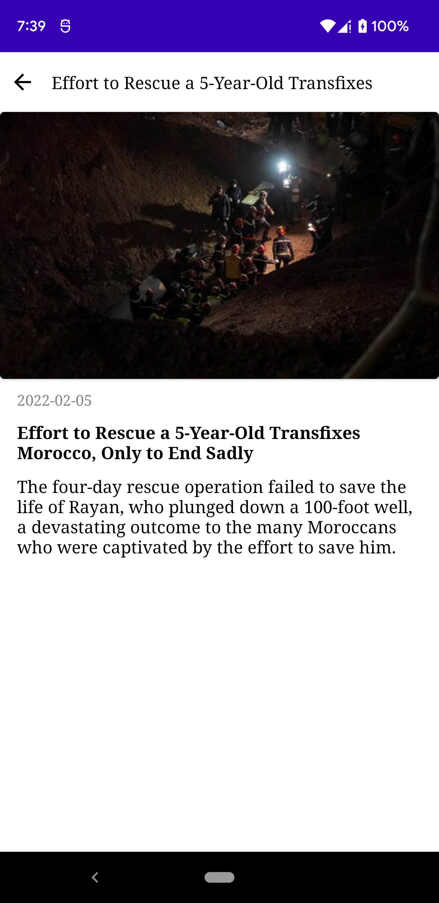
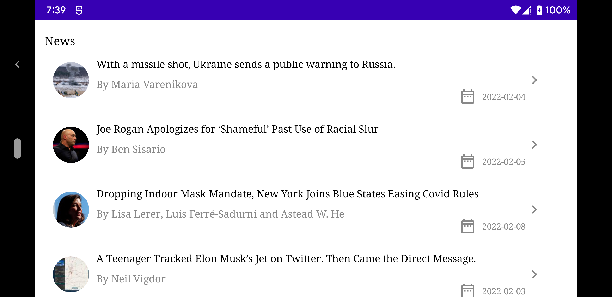
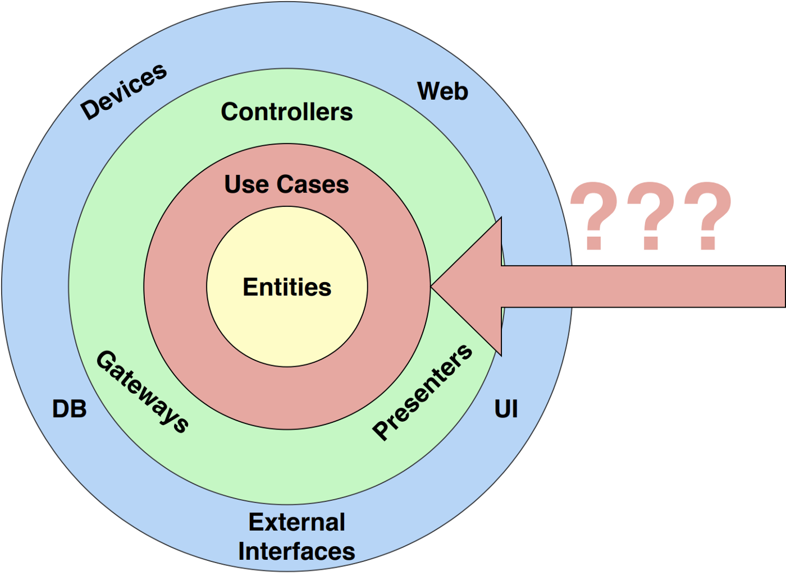
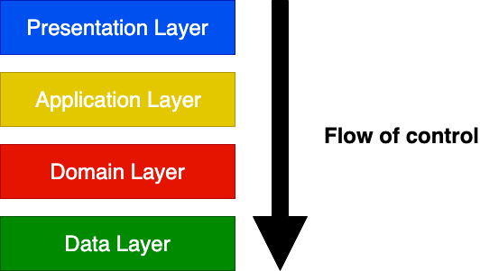

# News App
Android, Clean Architecture, MVVM, JetpackCompose, Kotlin Flows, Dagger Hilt, Retrofit, Coil

News App implemented using a modern approach of Android app development using MVVM Clean Architecture that is scalable and maintainable.

   

## Clean Architecture
Clean Architecture is a Use Case driven architecture, hence each repository method exists only because it is supporting a Use Case.

## Layered Architectures and the Application Layer

Separation of concerns
One of the primary goals of any architecture is the separation of concerns.
There are different ways a software system can be divided but after years of experimentation the industry converged on using few standard layers:

1. Presentation: Responsible for showing information to the user and interpreting user commands;
   
2. Application: Defines the jobs the software is supposed to do by orchestrating the data flow from and to the domain models;
   
3. Domain: Represents concepts of the business, information about the current situation and business rules;
   
4. Data: Responsible for persisting domain models.

## Jetpack Compose
Jetpack Compose is Android’s modern toolkit for building native UI. It simplifies and accelerates UI development on Android. Quickly bring your app to life with less code, powerful tools, and intuitive Kotlin APIs.

## Navigating with Compose
The Navigation component provides support for Jetpack Compose applications. You can navigate between composables while taking advantage of the Navigation component’s infrastructure and features.

## Kotlin flows
Flows are built on top of coroutines and can provide multiple values. A flow is conceptually a stream of data that can be computed asynchronously. 

## Dagger Hilt
Hilt is a dependency injection library for Android that reduces the boilerplate of doing manual dependency injection in your project,
Hilt is built on top of the popular DI library Dagger to benefit from the compile-time correctness.

## Coroutines
A coroutine is a concurrency design pattern that you can use on Android to simplify code that executes asynchronously.

## Coil
An image loading library for Android backed by Kotlin Coroutines. Coil is:

- Fast:
Coil performs a number of optimizations including memory and disk caching, down-sampling the image in memory, re-using bitmaps, automatically pausing/cancelling requests, and more.

- Lightweight:
Coil adds ~2000 methods to your APK (for apps that already use OkHttp and Coroutines), which is comparable to Picasso and significantly less than Glide and Fresco.

- Easy to use:
Coil's API leverages Kotlin's language features for simplicity and minimal boilerplate.

- Modern:
Coil is Kotlin-first and uses modern libraries including Coroutines, OkHttp, Okio, and AndroidX Lifecycles.

